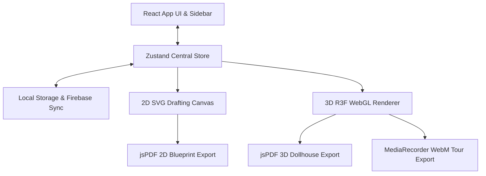

# itsmyplan — Product & Technical Documentation

Welcome to **itsmyplan**, a modern, web-based, desktop-grade CAD layout tool and 3D dollhouse visualizer designed to streamline room layout planning, interior design, and material takeoff estimation.

---

## 📣 Marketing Overview & Value Proposition

Designing a space is often a disconnected process: blueprints are drafted in complex 2D software, while 3D renderings are left to slow, expensive outsourcing. **itsmyplan** bridges this gap by providing an instant, unified experience. It is built for homeowners, renovation enthusiasts, interior designers, and kitchen/bathroom installers who need to iterate on room plans rapidly, estimate material budgets, and export professional blueprint documents.

### 🌟 Key Selling Points (KSPs)

* **Instant 2D-to-3D Synthesis**: Draft wall segments, doors, windows, and fixtures on a precision 2D blueprint grid, and toggle instantly to an interactive 3D dollhouse view. The 3D geometry is generated dynamically from 2D coordinates in milliseconds.
* **UK-Standard Fixture Library**: A pre-curated collection of bathroom, kitchen, bedroom, and living room fixtures designed around standard UK sizing (e.g. 762mm doors, freestanding baths, quadrant showers, kitchen base/corner units, laundry stacks, and radiators).
* **Silent 3D Video Tour Recording**: Record a walkthrough of your 3D dollhouse model directly within the app. By capturing the WebGL context stream, the app records your orbits, pans, and zooms smoothly at 30 FPS and downloads a `.webm` file without showing browser prompts or UI overlays.
* **Professional blueprint PDF Exports**: Generate landscape-oriented A4 PDF plans complete with dimension annotations, custom project metadata (Job Number, Client Name, version, and Operator), brand watermarks, and drawing scale indications (e.g. 1:50).
* **Interactive Text Annotations**: Label rooms, add instructions, or note site dimensions directly on the blueprint. Text boxes support draggable positioning, inline double-click editing, and style formatting (size, color presets, bold, and italic).
* **Automated Material Takeoff**: The built-in estimator automatically calculates floor areas (m²), wall surface areas (m²), base perimeters (linear meters), and fixture inventories, making it easy to generate material quotes and budget sheets.
* **Installable Progressive Web App (PWA)**: Full offline-first support. Once loaded, the application caches all static Next.js assets, enabling drafting and 3D previewing entirely without an active internet connection.
* **Safe Cloud Sync (Zero Server Default)**: Plans are persisted automatically to local storage. By signing in via Firebase, plans sync securely with a cloud database for cross-device support.

---

## 🛠️ Technical Architecture & Under-the-Hood Mechanics

**itsmyplan** is built as a client-side single page application using Next.js. Real-world dimensions are stored in **millimeters (mm)** as the source of truth, ensuring drafting precision.

### 1. The Core State Store (Zustand)
All room layout data is managed in a single, high-performance Zustand store (`src/store/usePlanStore.ts`):
* **Data Schema**: A plan consists of arrays of `Wall`, `Opening` (doors, windows), `Fixture`, `Measurement`, and `TextBox` models.
* **Coordinate Space**: The store uses a 2D coordinate space where `(x, y)` represent distances in millimeters.
* **History Stack**: Implements a linear undo/redo stack (capped at 50 states) that clones and restores arrays of coordinates.
* **State Sync**: Commits changes to browser storage immediately. If Firebase is configured and the user is authenticated, it serializes and uploads the plan to Firestore, stripping out any `undefined` values recursively to prevent write failures.

### 2. The 2D Drafting Engine (SVG)
The 2D blueprint view (`src/components/canvas2d/Canvas2D.tsx`) is rendered using pure Scalable Vector Graphics (SVG):
* **Performance**: SVG provides native vector sharpness, mouse event listeners on individual nodes, and scales cleanly under zoom.
* **Interactive Snapping**: Implements a geometry snap resolver (`src/utils/snapping.ts`) that locks mouse cursor inputs to grid intervals, perpendicular wall angles (15° steps when holding Shift), wall midpoints, and segment endpoints.
* **Annotation Layer**: Draws dimension trails along wall edges and overlays HTML textareas inside SVG `<foreignObject>` nodes during text box double-clicks for seamless inline editing.

### 3. The 3D WebGL Renderer (Three.js & React Three Fiber)
When the user toggles the view, the plan coordinates are synthesized into a 3D scene (`src/components/canvas3d/Scene3D.tsx`):
* **Dynamic Mesh Generation**: Wall meshes are built by calculating angles and distances between segment coordinates, extruded upwards (default 2400mm), and punched with hollow portals where doors and windows reside.
* **Custom Fixtures**: Instead of loading heavy exterior assets, fixtures are drawn using fast, low-polygon React three meshes (e.g. cylinder sector sweeps for quadrant shower trays and screens, layered appliances for washing/dryer towers, and silhouetted mannequin geometries for scale figures).
* **Rendering Optimization**: Uses `preserveDrawingBuffer: true` in the WebGL context. This keeps the graphic buffer active, allowing the app to convert canvas frames into images or capture them into video streams.

### 4. Video & Document Exporters
* **Video Tour Recorder**: Grabs the active WebGL context and calls `canvas.captureStream(30)`. This stream is fed into the browser's native `MediaRecorder` API. Chunk buffers are compiled on stop into a `video/webm` Blob and downloaded via an anchor element click.
* **A4 Blueprint Exporter**: Standardizes layout printing scale. The SVG element is cloned, stripped of canvas viewports, injected with custom print stylesheet variables, converted to a PNG data URL, and drawn onto a jsPDF landscape document layout alongside metadata borders.

### 5. Offline & PWA Service Worker
* A custom network-first service worker (`public/sw.js`) caches the HTML shell, manifest, icons, and bundle scripts during initial loading.
* Offline requests are intercepted and served from the cache, while API calls (Firestore database, Firebase Auth) are bypassed to allow local usage when offline.